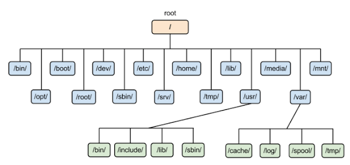

# Filesystem Hierarchy Standard (FHS)

---

## 🎯 Learning Objectives

After completing this chapter, you will be able to:

- Understand what the **Filesystem Hierarchy Standard (FHS)** is and why it is important.
- Explain the purpose of the root directory (`/`) in Linux.
- Identify the major directories defined by the FHS and their functions.
- Distinguish between user directories and system directories.
- Locate common system files, configuration files, logs, applications, and user data.
- Understand how Linux organizes files and directories in a standardized manner.
- Navigate the Linux directory structure with confidence.
- Recognize why understanding FHS is essential for Linux administration, software development, cloud computing, and DevOps.

---

## 📖 Introduction

The **Filesystem Hierarchy Standard (FHS)** defines the standard directory structure used by Linux systems. It specifies where files, directories, applications, configuration files, logs, and user data should be stored, ensuring consistency across different Linux distributions.

Instead of organizing files randomly, Linux follows a well-defined hierarchy that begins with the **root directory (`/`)**. Every file and directory on the system is located somewhere within this single directory tree. This standardized layout makes Linux systems easier to use, administer, troubleshoot, and maintain, regardless of the distribution.

Understanding the Filesystem Hierarchy Standard is a fundamental skill for anyone working with Linux. Whether you are a developer, system administrator, DevOps engineer, or cloud engineer, knowing where important files are stored helps you navigate the system efficiently, manage applications, troubleshoot issues, and automate administrative tasks.

In this chapter, you will explore the Linux directory structure, understand the purpose of the major directories defined by the FHS, and learn how Linux organizes files in a logical and consistent manner.

---

## 📂 What is the Filesystem Hierarchy Standard (FHS)?

The **Filesystem Hierarchy Standard (FHS)** is a specification that defines the standard directory structure used by Linux operating systems. It specifies where files, directories, applications, libraries, configuration files, logs, and user data should be stored, ensuring a consistent layout across Linux distributions.

Instead of organizing files differently on every distribution, FHS provides a common directory hierarchy that developers, system administrators, and applications can rely on. This consistency makes Linux systems easier to use, maintain, and troubleshoot.

Most modern Linux distributions—including **Ubuntu**, **Debian**, **Fedora**, **RHEL**, **Rocky Linux**, and **openSUSE**—follow the Filesystem Hierarchy Standard.

### Key Objectives of FHS

- Standardize the Linux directory structure.
- Ensure consistency across Linux distributions.
- Improve software compatibility and portability.
- Simplify system administration and maintenance.
- Help users locate files and directories easily.

> **Key Point:** The Filesystem Hierarchy Standard (FHS) defines **where different types of files and directories should be stored**, providing a predictable and organized directory structure across Linux systems.

---

## 🤔 Why Do We Need FHS?

The Linux file system follows a **hierarchical tree structure** that begins with the **root directory (`/`)**. Every file, directory, storage device, and mounted file system is organized under this single root directory.

Unlike Windows, which uses multiple drive letters such as **C:** and **D:**, Linux organizes everything within one unified directory hierarchy.

A simplified Linux directory structure is shown below:

```text
/
├── bin
├── boot
├── dev
├── etc
├── home
├── lib
├── lib64
├── media
├── mnt
├── opt
├── proc
├── root
├── run
├── sbin
├── srv
├── sys
├── tmp
├── usr
└── var
```

Each directory has a specific purpose defined by the Filesystem Hierarchy Standard. In the following sections, you will explore each of these directories, understand what they contain, and learn their role in the Linux operating system.

> **Key Point:** Every file and directory in Linux starts from the **root directory (`/`)**, creating a single, organized directory hierarchy that simplifies file management and system administration.

---

## 🌳 Linux Directory Structure

The Linux file system follows a **hierarchical tree structure** that begins with the **root directory (`/`)**. Every file, directory, storage device, and mounted file system is organized under this single root directory.

Unlike Windows, which uses multiple drive letters such as **C:** and **D:**, Linux organizes everything within one unified directory hierarchy.

### Linux Directory Hierarchy

<p align="center">
  
</p>

The diagram above illustrates the Linux directory hierarchy defined by the **Filesystem Hierarchy Standard (FHS)**. Every top-level directory has a specific purpose and stores a particular type of data.

In the following sections, you will explore each directory, understand its purpose, and learn where Linux stores applications, configuration files, logs, user data, and system resources.

> **Key Point:** Every file and directory in Linux starts from the **root directory (`/`)**, creating a single, organized directory hierarchy that simplifies file management and system administration.

## 📁 Important Linux Directories

### Root Directory (`/`)

The `/` directory is the **root of the entire Linux file system hierarchy**. Every file and directory exists somewhere under `/`.

**Common Contents**

- `/home` – User files
- `/etc` – Configuration files
- `/var` – Variable data and logs
- `/usr` – Applications and utilities

> **Key Point:** `/` is the starting point of the Linux file system.

---

### `/bin`

Contains essential command-line executables required by users and the system.

**Examples**

```text
ls
cp
mv
cat
```

> **Note:** On modern Linux distributions, `/bin` is often a symbolic link to `/usr/bin`.

---

### `/boot`

Contains files required to boot the Linux system.

**Common Contents**

- Linux kernel
- GRUB configuration
- Initial RAM filesystem (initramfs)

**Example**

```text
/boot/vmlinuz
/boot/grub/
```

---

### `/dev`

Contains **device files** that provide access to hardware and virtual devices.

**Examples**

```text
/dev/sda
/dev/null
/dev/tty
```

> **Key Point:** Linux represents many hardware devices as files.

---

### `/etc`

Contains **system-wide configuration files**.

**Examples**

```text
/etc/hosts
/etc/passwd
/etc/ssh/
/etc/fstab
```

> **Key Point:** `/etc` is one of the most important directories for Linux administration.

---

### `/home`

Contains the personal directories of regular users.

**Example**

```text
/home/kiran
/home/user1
```

User-specific files such as documents, downloads, and application configuration are typically stored here.

---

### `/lib` and `/lib64`

Contain essential shared libraries and kernel-related modules required by system programs.

**Examples**

```text
/lib
/lib64
```

> **Note:** On many modern 64-bit Linux distributions, these directories may be symbolic links into `/usr/lib`.

---

### `/media`

Used as a mount point for **removable storage devices**.

**Examples**

```text
/media/kiran/USB
/media/kiran/DISK
```

USB drives and other removable media are commonly mounted here automatically by desktop environments.

---

### `/mnt`

Used as a temporary mount point for manually mounted file systems.

**Example**

```text
/mnt/data
```

> **Key Point:** `/mnt` is commonly used by administrators when temporarily mounting storage.

---

### `/opt`

Used for **optional or third-party software packages** that are installed outside the standard system package structure.

**Example**

```text
/opt/my-application/
```

> **Key Point:** `/opt` is useful for self-contained third-party applications.

---

### `/proc`

A **virtual file system** that provides information about running processes and the Linux kernel.

**Examples**

```text
/proc/cpuinfo
/proc/meminfo
/proc/uptime
```

The files in `/proc` generally represent information provided dynamically by the kernel rather than regular files stored on disk.

---

### `/root`

The home directory of the **root user**.

```text
/root
```

> **Key Point:** `/root` is different from `/`, which is the root of the entire file system.

---

### `/run`

Contains **runtime data** created since the system booted.

**Examples**

- Process IDs
- Unix sockets
- Service runtime information
- Lock files

```text
/run
```

The contents are generally temporary and are recreated during boot.

---

### `/sbin`

Contains essential system administration executables.

**Examples**

```text
/sbin/fsck
/sbin/reboot
```

> **Note:** On modern Linux distributions, `/sbin` is often a symbolic link to `/usr/sbin`.

---

### `/srv`

Contains data served by system services.

**Examples**

```text
/srv/www/
```

It can be used for data provided by services such as web or file servers.

---

### `/sys`

A virtual file system that exposes information about **devices, hardware, and the Linux kernel**.

**Example**

```text
/sys/class/
/sys/devices/
```

It is primarily used by the kernel and system tools to interact with and inspect hardware.

---

### `/tmp`

Used for **temporary files** created by applications and users.

```text
/tmp
```

Temporary files may be removed automatically during system reboot or according to system policies.

> **Key Point:** Do not store important or permanent data in `/tmp`.

---

### `/usr`

Contains the majority of **user-space applications, utilities, libraries, and shared resources**.

**Important Subdirectories**

```text
/usr/bin
/usr/sbin
/usr/lib
/usr/share
```

> **Key Point:** `/usr` contains most of the software and resources used by the Linux system.

---

### `/var`

Contains **variable data** that changes during normal system operation.

**Common Contents**

```text
/var/log
/var/cache
/var/lib
/var/tmp
```

Examples include logs, package data, caches, databases, and other application-generated data.

> **Key Point:** `/var` is especially important when troubleshooting Linux servers because system and application logs are commonly stored under `/var/log`.

---

## 🆚 User Directories vs System Directories

Linux separates **user data** from **system files and resources** to keep the operating system organized and easier to manage.

### 👤 User Directories

User directories primarily contain files and data belonging to individual users.

| Directory | Purpose                                           |
| --------- | ------------------------------------------------- |
| `/home` | Home directories of regular users                 |
| `/root` | Home directory of the root user                   |
| `/tmp`  | Temporary files created by users and applications |

**Example:**

```text
/home/kiran/
├── Documents/
├── Downloads/
├── Projects/
└── Pictures/
```

---

### ⚙️ System Directories

System directories contain files required by the operating system, installed software, hardware management, and system services.

| Directory | Purpose                                |
| --------- | -------------------------------------- |
| `/boot` | Boot-related files                     |
| `/dev`  | Device files                           |
| `/etc`  | System configuration                   |
| `/usr`  | Applications, libraries, and utilities |
| `/var`  | Logs and other variable system data    |
| `/proc` | Process and kernel information         |
| `/sys`  | Hardware and kernel information        |
| `/run`  | Runtime system data                    |
| `/lib`  | Essential libraries                    |

### 📊 Quick Comparison

| User Directories            | System Directories                           |
| --------------------------- | -------------------------------------------- |
| Mainly store user data      | Mainly store system resources                |
| User-specific               | System-wide                                  |
| Usually managed by users    | Usually managed by administrators/system     |
| Example:`/home/kiran`     | Example:`/etc`, `/usr`, `/var`         |
| Personal files and projects | Configuration, applications, logs, libraries |

> **Key Point:** User directories primarily contain **personal data**, while system directories contain the **files and resources required to operate and manage the Linux system**.

---

## 🌍 Real-World Example

> How Linux organizes applications, configuration files, logs, and user data.

---

## 🚀 Why Understanding FHS Matters

Understanding the Filesystem Hierarchy Standard helps you quickly locate files, troubleshoot Linux systems, and work confidently across different Linux environments.

### 👨‍💻 For Developers

- Understand where applications, libraries, and configuration files are located.
- Work with Linux file paths correctly in applications and scripts.
- Locate application logs and runtime data during debugging.
- Deploy applications using standard Linux directory structures.

### 🛠️ For System Administrators

- Locate and manage system configuration files.
- Find logs and system data for troubleshooting.
- Manage applications, services, and storage effectively.
- Maintain a consistent directory structure across Linux systems.

### 🚀 For DevOps Engineers

- Understand file locations during application deployments.
- Work with configuration files, logs, and environment files.
- Troubleshoot applications running on Linux servers and containers.
- Write reliable scripts and automation using standard Linux paths.

### ☁️ For Cloud Engineers

- Navigate Linux virtual machines efficiently.
- Troubleshoot cloud-hosted applications and services.
- Locate logs, configurations, and application data.
- Understand Linux paths used by cloud tools and automation.

> **Key Point:** Knowing the Linux directory structure allows you to quickly understand **where things are, what they are used for, and where to look when something goes wron**

### For Developers

### For System Administrators

### For DevOps Engineers

### For Cloud Engineers

---

## 💻 Hands-on Practice

---

## 🎯 Interview Questions

---

## 📝 Summary

---

## 📚 References
